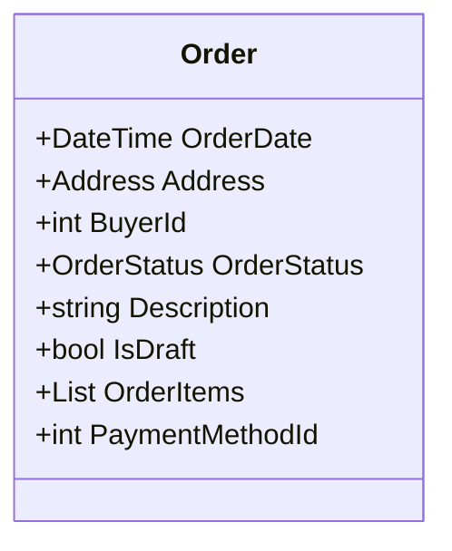

::header::
# Entities, Value Objects, and Aggregates

::left::
## Entities
Objects that have a distinct identity

e.g. Product
<LightOrDark>
    <template #light>
      
    </template>
    <template #dark>
      
    </template>
</LightOrDark>

::center::
## Value Objects
Objects without a distinct identity; defined by their attributes

e.g. Price
<LightOrDark>
    <template #light>
      
    </template>
    <template #dark>
      
    </template>
</LightOrDark>

::right::
## Aggregates
Clusters of related entities and value objects

e.g. Order

<!-- <LightOrDark>
    <template #light>
      
    </template>
    <template #dark>
      
    </template>
</LightOrDark> -->
