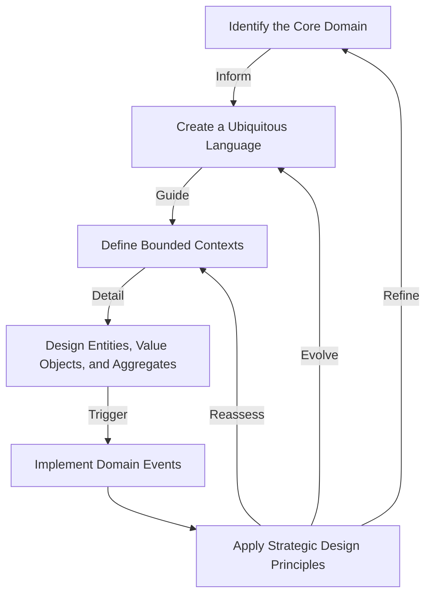

# Implementing DDD

```mermaid
graph TD
    A[Identify the Core Domain] -->|Inform| B[Create a Ubiquitous Language]
    B -->|Guide| C[Define Bounded Contexts]
    C -->|Detail| D[Design Entities, Value Objects, and Aggregates]
    D -->|Trigger| E[Implement Domain Events]
    E --> F[Apply Strategic Design Principles]
    F -->|Reassess| C
    F -->|Evolve| B
    F -->|Refine| A

```

