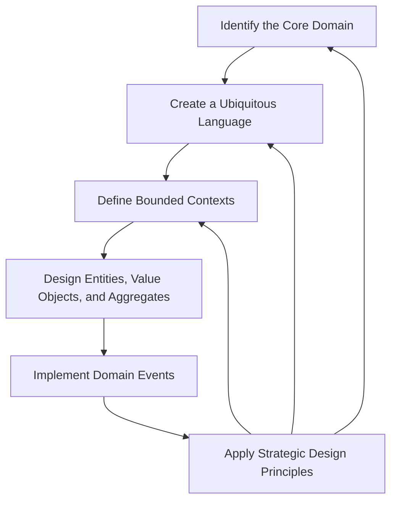

# Implementing DDD

```mermaid
graph TD
    A[Identify the Core Domain] --> B[Create a Ubiquitous Language]
    B --> C[Define Bounded Contexts]
    C --> D[Design Entities, Value Objects, and Aggregates]
    D --> E[Implement Domain Events]
    E --> F[Apply Strategic Design Principles]
    F --> C
    F --> B
    F --> A

```

