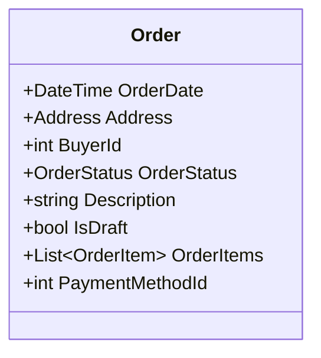
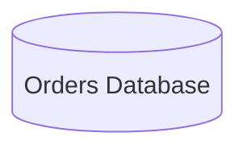
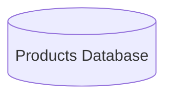
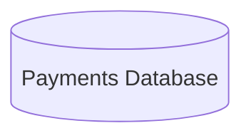
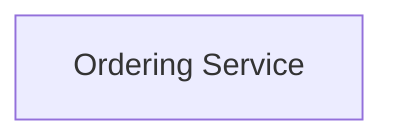

# Strategic Design

 

## The high-level design decisions that shape the architecture and organization of the software

<!-- Div 1 -->

## Aggregates

<!-- Div 2 -->

## Repositories

<!-- Div 3 -->

## Services

