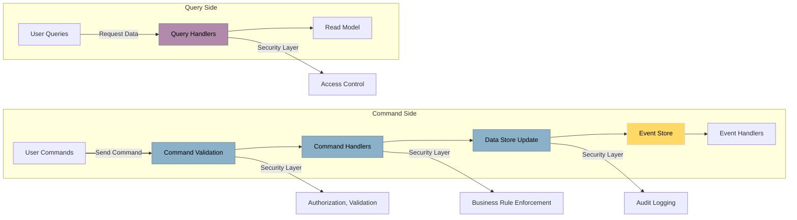
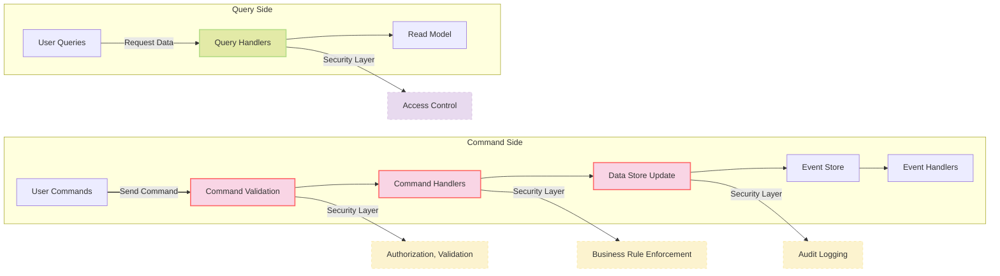

# Benefits of CQRS

<v-clicks>

- Improved performance
- Scalability
- Simplified query logic
- Security benefits

</v-clicks>

<v-clicks>

<LightOrDark>
    <template #dark>

    </template>
    <template #light>

    </template>
</LightOrDark>

</v-clicks>