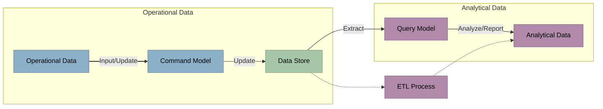
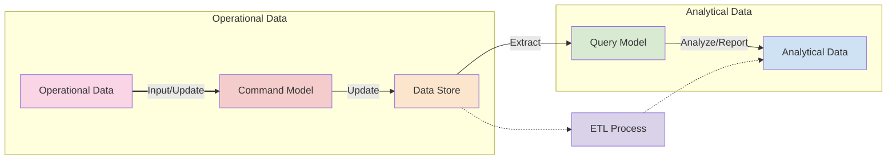

# Core Components

<v-clicks>

- Command and Query Separation
- Operational vs. Analytical data
- Eventual consistency
</v-clicks>

<v-clicks>

<LightOrDark>
    <template #dark>

    </template>
    <template #light>

    </template>
</LightOrDark>

</v-clicks>