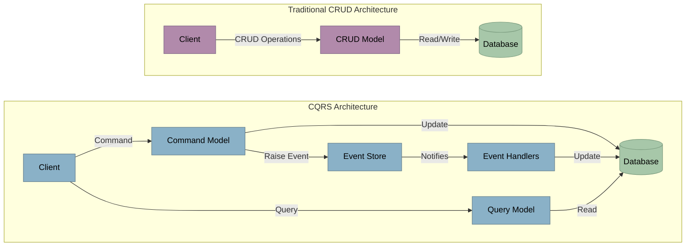
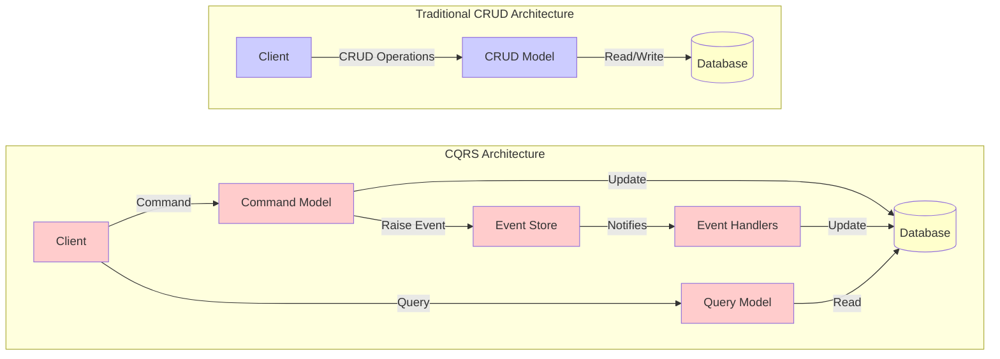
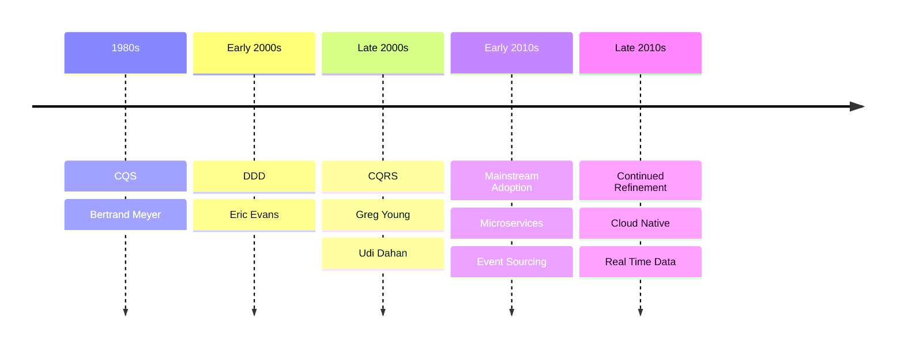

# Command Query Responsibility Segregation

<v-clicks>

- What is CQRS?
- How it differs from traditional architectures
</v-clicks>

<v-clicks>

<LightOrDark>
    <template #dark>

    </template>
    <template #light>

    </template>
</LightOrDark>

</v-clicks>

---

# History

